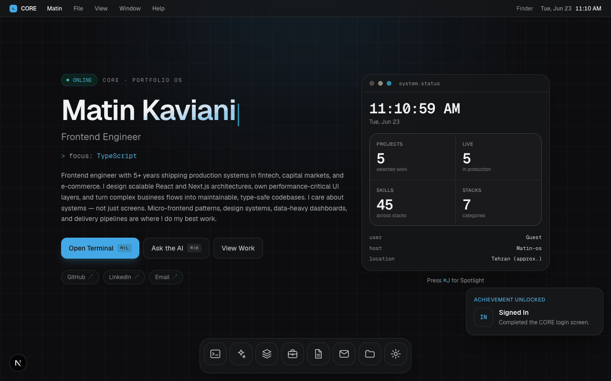

# CORE — Portfolio OS

An interactive portfolio that behaves like a lightweight desktop OS — terminal, AI assistant, projects, experience, résumé, contact, and more, all in the browser.

**Live demo:** [matinkaviani.net](https://www.matinkaviani.net)



---

## Features

### Desktop experience
- **Boot sequence & login** — animated startup, optional guest name, session persistence
- **Window manager** — draggable, resizable, minimizable windows with Mission Control (`⌃↑` / F3)
- **Dock & menu bar** — macOS-inspired chrome with live clock and app switcher
- **Command palette** — Spotlight-style search for apps, projects, files, and commands (`⌘J`)
- **Context menus** — right-click on desktop, dock, and windows
- **Deep links** — shareable URLs (`?app=projects&project=qaay`, `?app=assistant&mode=recruiter`, etc.)
- **Achievements** — hidden Easter eggs (Konami code, `sudo`, open-all-apps, and more)

### Built-in apps
| App | What it does |
|-----|----------------|
| **Terminal** | Full shell with `help`, `projects`, `experience`, `skills`, `ls` / `cat`, `open <app>`, and more |
| **Core AI** | Groq-powered chat grounded in portfolio content; recruiter mode with job-description matching |
| **Projects** | Case-study browser with stack, status, and detail views |
| **Experience** | Career timeline with highlights |
| **Résumé** | Quick Look CV with PDF download |
| **Contact** | Form with Cloudflare Turnstile + Resend delivery |
| **Finder** | Browse markdown content under `/content` |
| **Settings** | Wallpapers, accent color, reduced motion, live cursors, skip boot |

### Real-time & content
- **Live cursors** — multiplayer presence via Cloudflare Durable Objects (toggle in Settings)
- **Markdown-driven content** — profile, projects, experience, and skills live in `content/`; build generates a snapshot
- **Local AI fallback** — assistant still answers from the knowledge base when API keys are absent

---

## Stack

| Layer | Tech |
|-------|------|
| **Framework** | [Next.js 16](https://nextjs.org/) (App Router), React 19, TypeScript |
| **Styling** | Tailwind CSS 4, [shadcn/ui](https://ui.shadcn.com/), Framer Motion |
| **AI** | [Vercel AI SDK](https://sdk.vercel.ai/) + [Groq](https://groq.com/) |
| **Email** | [Resend](https://resend.com/) |
| **Bot protection** | [Cloudflare Turnstile](https://developers.cloudflare.com/turnstile/) |
| **Deploy** | [Cloudflare Workers](https://developers.cloudflare.com/workers/) via [OpenNext](https://opennext.js.org/cloudflare) |
| **Realtime** | Cloudflare Durable Objects (WebSocket cursor room) |

---

## Getting started

### Prerequisites
- Node.js 20+
- [pnpm](https://pnpm.io/) 10+

### Install & run

```bash
pnpm install
cp .env.example .env   # fill in keys for AI, contact, Turnstile
pnpm dev
```

Open [http://localhost:3000](http://localhost:3000).

### Environment variables

| Variable | Purpose |
|----------|---------|
| `GROQ_API_KEY` | Core AI assistant (Groq) |
| `RESEND_API_KEY` | Contact form delivery |
| `CONTACT_TO_EMAIL` | Inbox for contact submissions |
| `RESEND_FROM` | Verified sender address |
| `TURNSTILE_SECRET_KEY` | Server-side Turnstile verification |
| `TURNSTILE_SITE_KEY` / `NEXT_PUBLIC_TURNSTILE_SITE_KEY` | Client widget |

See [`.env.example`](./.env.example) for details and Cloudflare secret setup.

---

## Scripts

| Command | Description |
|---------|-------------|
| `pnpm dev` | Next.js dev server |
| `pnpm build` | Generate content snapshot + production build |
| `pnpm build:cf` | OpenNext Cloudflare build |
| `pnpm preview` | Local Cloudflare preview (Wrangler) |
| `pnpm deploy` | Build and deploy to Cloudflare Workers |
| `pnpm generate:content` | Regenerate `portfolio.snapshot.json` from markdown |

### Regenerate the README demo GIF

With the dev server running on port 3000:

```bash
# one-off: install Playwright in a temp dir, then:
CORE_ROOT=$PWD node scripts/capture-demo-gif.mjs
```

Output: `docs/demo.gif`

---

## Project structure

```
app/              Next.js routes, API (assistant, contact, cursors)
components/
  apps/           Terminal, AI, Projects, Experience, Résumé, Contact, Finder, Settings
  os/             Desktop shell — dock, windows, boot, shortcuts, achievements
content/          Markdown + JSON portfolio source
lib/              Content loading, AI persona, OS utilities
worker/           Cloudflare Worker entry + CursorRoom Durable Object
scripts/          Content snapshot + demo capture
```

---

## Deploy

Production runs on **Cloudflare Workers** at [matinkaviani.net](https://www.matinkaviani.net).

```bash
pnpm deploy
```

Set secrets in the Cloudflare dashboard (or `wrangler secret put`) for `GROQ_API_KEY`, `RESEND_API_KEY`, and Turnstile keys. Use `pnpm deploy -- --keep-vars` so dashboard variables are not wiped on deploy.

---

## Keyboard shortcuts

| Shortcut | Action |
|----------|--------|
| `⌘J` | Command palette |
| `⌃↑` / F3 | Mission Control |
| `⌘⇧L` | Open Terminal |
| `⌘⇧K` | Open Core AI |
| `Esc` | Close palette / Mission Control |

---

## License

Private portfolio project — © Matin Kaviani.
